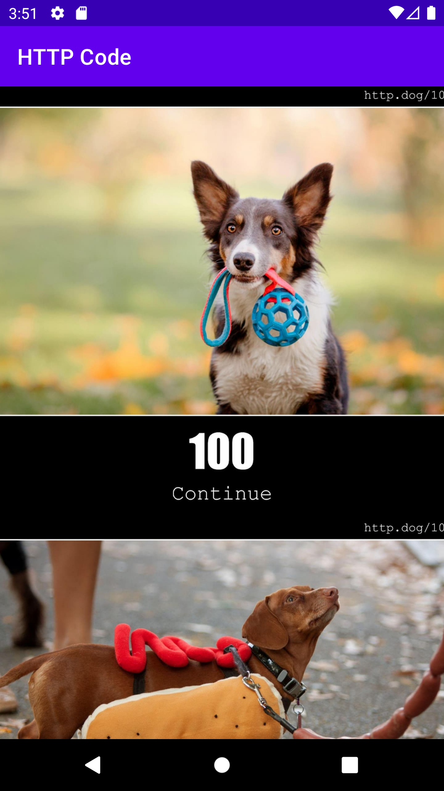
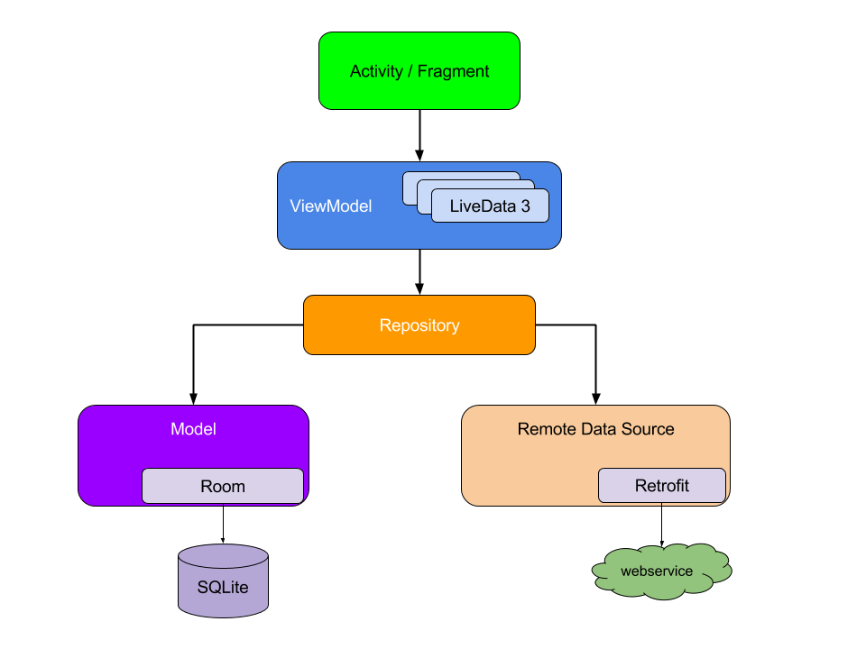

# HTTPCode is a Android Project with MVVM Architecture

HTTPCode is a simple project on Android List Based. 
This app show a cute images regarding HTTP Codes.

The main idea of the project is follow the MVVM Architecture.

Topics on this project:
  - Kotlin Language 
  - MVVM Project
  - Get data from public API with Retrofit
  - Save local data with RoomDatabase and SQLite
  - Coroutines 
  - Picaso Library

Links used as reference for this project
  - [Picaso and kotlin](https://camposha.info/android-examples/android-picasso/#gsc.tab=0)
  - [Android Room com View:Kotlin](https://developer.android.com/codelabs/android-room-with-a-view-kotlin#0)
  - [Retrofit Android Example Kotlin](https://howtodoandroid.com/retrofit-android-example-kotlin/)
  - [MVVM with Kotlin Coroutines and Retrofit](https://medium.com/android-beginners/mvvm-with-kotlin-coroutines-and-retrofit-example-d3f5f3b09050)
  - [CodeLab Repository](https://developer.android.com/codelabs/basic-android-kotlin-training-repository-pattern#0)
  - [Operações Assíncronas com Coroutines no Kotlin](https://cursos.alura.com.br/extra/webseries-coroutines-kotlin/operacoes-assincronas-no-kotlin-1-apresentacao-w1225)

Images used from https://http.dog/ - Dogs for every HyperText Transfer Protocol response status code.
API Server from [{ JSONSERVE }](https://jsonserve.com/) Host your JSON easily and use in your apps

I would like to say thank you to [Leon Manickchand](https://www.linkedin.com/in/manickchand/) for support and mentoring.
